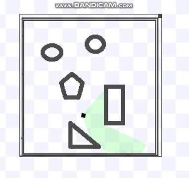

I dump my study notes here because I have a habit of losing physical copies.

### Publications

1.  [**An Analysis of Causal Effect Estimation using Outcome Invariant Data Augmentation**](https://neurips.cc/virtual/2025/poster/119327)  
**U. Akbar**, N. Kilbertus, H. Shen, K. Muandet, B. Dai,
*Advances in Neural Information Processing Systems (NeurIPS)*, 2025 **(Spotlight, top ~3%)**  
\[[bibtex](bibtex/neurips25.txt)\]
\[[pdf](https://arxiv.org/pdf/2510.25128)\]
\[[webpage](https://uzairakbar.com/causal-data-augmentation/)\]

3.  [**Adversarial Appearance Learning in Augmented Cityscapes for Pedestrian Recognition in Autonomous Driving**](https://ieeexplore.ieee.org/abstract/document/9197024)  
A. Savkin, T. Lapotre, K. Strauss, **U. Akbar**, F. Tombari,
*IEEE International Conference on Robotics and Automation (ICRA)*, 2020  
\[[bibtex](bibtex/icra20.txt)\]
\[[pdf](/papers/ICRA20.pdf)\]

4.  [**Performance Analysis of Decoupled Cell Association in Multi-Tier Hybrid Networks using Real Blockage Environments**](https://ieeexplore.ieee.org/abstract/document/7986263)  
O. W. Bhatti, H. Suhail, **U. Akbar**, S. A. Hassan, H. Pervaiz, L. Musavian, Q. Ni,
*IEEE International Wireless Communications and Mobile Computing Conference (IWCMC)*, June 2017  
\[[bibtex](bibtex/iwcmc17.txt)\]
\[[pdf](/papers/IWCMC17.pdf)\]

<!-- ### Talks

1. Invited talk: Toward intuitive human controlled MAVs: motion primitives based teleoperation  
*IROS 2018 workshop: Vision based Drones: What's Next?* -->

### Other projects

1. DeepRacer Gym; A Gymnasium wrapper for the AWS DeepRacer simulator
\[[code](https://github.com/uzairakbar/deepracer)\]
\[[docs](https://uzairakbar.com/deepracer)\]
[<a class="gif-link" id="deepracer">gif</a>]

2. LIDAR based obstacle avoidance using reinforcment learning
\[[code](https://github.com/uzairakbar/rl-obstacle-avoidance)\]
[<a class="gif-link" id="rl-obstacle-avoidance-sim">sim</a>/<a class="gif-link" id="rl-obstacle-avoidance-real">real</a> gifs]

